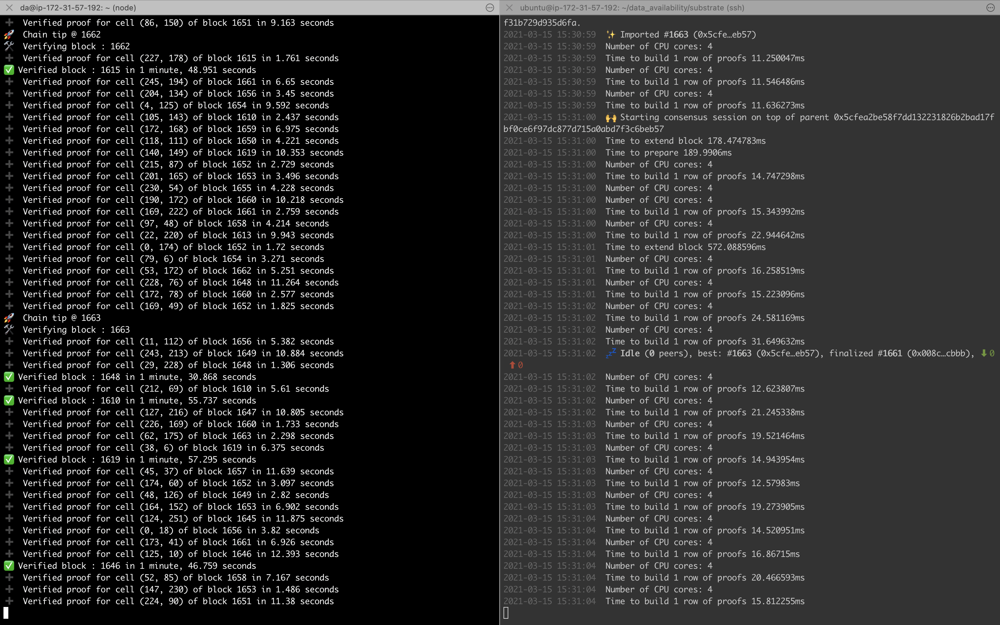

# da-light-client

Light client for Data Availability Blockchain of Polygon 🐿



## Introduction

Naive approach for building one DA light client, which will do following

- Listen for newly mined blocks
- As soon as new block is available, attempts to eventually gain confidence by asking for proof from full client _( via JSON RPC interface )_ for `N` many cells where cell is defined as `{row, col}` pair
- For lower numbered blocks, for which no confidence is yet gained, does batch processing in reverse order i.e. prioritizing latest blocks over older ones

## Installation

- First clone this repo in your local setup & run 👇 in root of this project, which will download all dependencies

```bash
npm i
```

- Create one `.env` file in root of project & put following content

```bash
touch .env
```

```
WSURI=ws://localhost:9944
HTTPURI=http://localhost:9933
AskProofCount=15
BatchSize=10
PORT=7000

```

Environment Variable | Interpretation
--- | ---
WSURI | Light client subcribes to full node, over **Websocket** transport, for receiving notification, as soon as new block gets mined 
HTTPURI | HTTP URI for making RPC calls to a full node
AskProofCount | For each new block seen by light client, it'll ask for these many proofs & verify those
BatchSize | At max this many blocks to be attempted to be verified, asynchronously, in a single go
PORT | Light client exposes RPC server over HTTP, at this port number

- Now, let's run light client

```bash
make run
```

## Usage

Given block number ( as decimal number/ string ) returns confidence obtained by light client for this block

```bash
curl -s -H 'Content-Type: application/json' -d '{"jsonrpc":"2.0","method":"get_blockConfidence","params": {"number": 223}, "id": 1}' http://localhost:7000/v1/json-rpc | jq
```

```json
{
  "jsonrpc": "2.0",
  "id": 1,
  "result": {
    "number": 223,
    "confidence": "99.99223 %"
  }
}
```

For malformed block numbers, following will be responded with

```bash
curl -s -H 'Content-Type: application/json' -d '{"jsonrpc":"2.0","method":"get_blockConfidence","params": {"number": true}, "id": 1}' http://localhost:7000/v1/json-rpc | jq # Block number is intentionally sent as `boolean`
```

```json
{
  "jsonrpc": "2.0",
  "id": 1,
  "result": {
    "number": true,
    "confidence": "0 %",
    "error": "Block number must be number/ string"
  }
}
```

> Note : You'll receive `0 %` in response, when no verification is yet done for requested block.

**More info coming ...**
