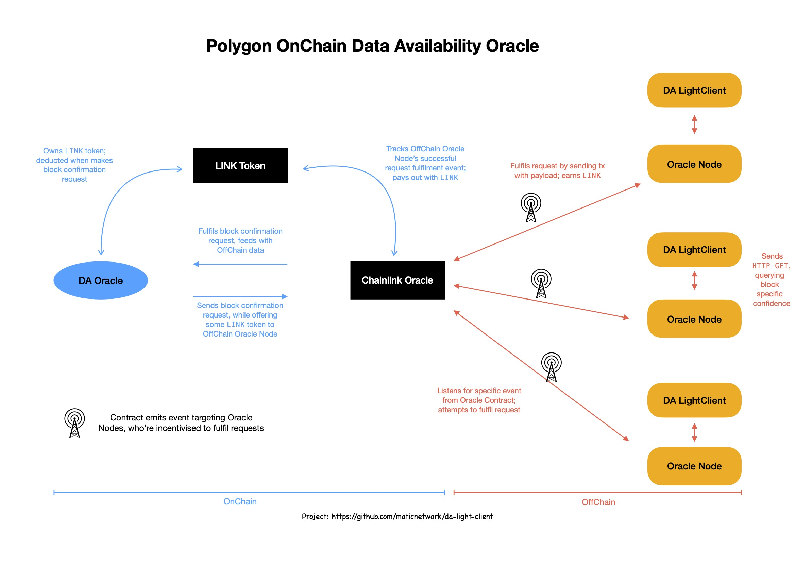
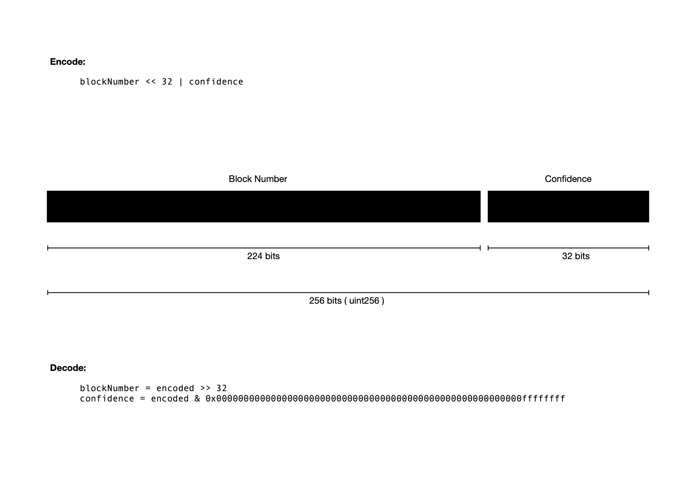

## DA OnChain Light Client

### Architecture



Data Availability onchain light client uses **Chainlink Oracle Network** to bring in respective block confidence from outer world.

Flow is like

- Invoke `requestConfidence(...)` while providing it with block number of interest
- It'll use chainlink oracle to send request to outer world, which will be eventually picked up by designated Oracle Node & fulfilled
- Before fulfilment, oracle node fetches confidence gained by specified Light Client for mentioned block & picks `serialisedConfidence` field's value from JSON response
- Sends onchain transaction fulfilling request, where as function payload, value for field `serialisedConfidence` is passed

Confidence serialisation is done using

> `(<block-number> << 32) | <confidence>`

in 32 bytes fixed space.

But confidence can't be represented as floating point number onchain, which is why it's represented out of 10 ** 9.

What offchain light client does, it first computes confidence out of 100 ( i.e. as percent ), puts it in `confidence` field & for `serialisedConfidence` field prepares it as `confidence * 10 ** 7` _( essentially out of 10 ** 9 )_

Now 10 ** 9 can be highest gained confidence for certain block, which can be easily represented with in **4 bytes**.

Remaining **28 bytes** from MSB side kept for putting block number.

Deserialisation logic is written in `DAOracle.deserialise(...)`, which will be invoked when chainlink node will fulfil request.

Finally you can check `confidence` public associative array for querying confidence for guevn block number.

Here's one visual



## Deployment Details

### Polygon Mumbai Test Network

Contract | Address
--- | ---
LINK Token | `0x70d1F773A9f81C852087B77F6Ae6d3032B02D2AB`
Chainlink Oracle | `0x1cf7D49BE7e0c6AC30dEd720623490B64F572E17`
DA Oracle | `0xE830b1d5AC84033d23E3Ac28722BaD1f716E24f4`

## Utilities

[Here's](./scripts/pastEvents.js) one handy script for querying `BlockConfidence` events, emitted by DAOracle, during request fulfilment phase.

```
node scripts/pastEvents.js
```
